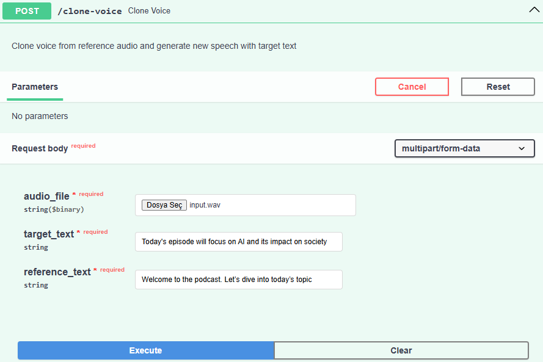
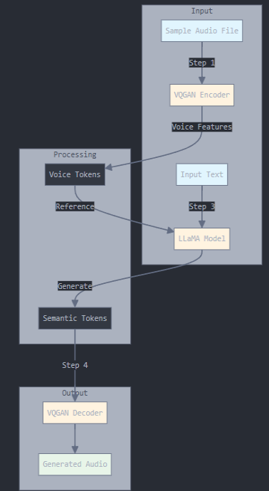

# Voice Cloning API

A FastAPI-based REST API wrapper for the [Fish-Speech](https://github.com/fishaudio/fish-speech) voice cloning model. This API allows you to clone voices and generate new speech with custom text using the Fish-Speech model.

## Credits

This project is a REST API wrapper built around the Fish-Speech model. All credit for the underlying voice cloning technology goes to:

- Original Repository: [Fish-Speech](https://github.com/fishaudio/fish-speech)
- License: [Original License](https://github.com/fishaudio/fish-speech/blob/main/LICENSE)
- Authors: Fish-Speech Team

## Features

- Upload reference audio file
- Provide reference and target text
- Generate cloned voice speaking the target text
- CPU/CUDA support

## Prerequisites

- Python 3.8+
- FastAPI
- PyTorch
- Fish-Speech model checkpoints

## Installation

1. Clone the repository:
```bash
git clone [your-repo-url]
cd voice-cloning-app
```

2. Create and activate virtual environment:
```bash 
python -m venv venv
# On Windows
.\venv\Scripts\activate
# On Linux/Mac
source venv/bin/activate
```
3. Install dependencies:
```bash 
pip install -r requirements.txt
```
4. Download the Fish-Speech model:
```bash 
huggingface-cli download fishaudio/fish-speech-1.5 --local-dir checkpoints/fish-speech-1.5
```

## Usage
1. Start the FastAPI server:
```bash 
uvicorn app.main:app --reload
```
2. Access the API documentation at http://localhost:8000/docs

# Example Usage
1. Upload Reference Audio and Generate New Speech
Access the
- Swagger UI at http://localhost:8000/docs:



# Use the /clone-voice endpoint with:

    - Audio File: Your reference voice recording
    - Reference Text: The exact words spoken in your reference audio
    - Target Text: The new text you want to generate

# Example Request:
- Audio File: your_voice.wav
- Reference Text: "Welcome to the podcast. Let’s dive into today’s topic." (reference text must match exactly what's said in the input audio)
- Target Text: "Today's episode will focus on AI and its impact on society."

2. Successful response will look like
```json
{
  "status": "success",
  "message": "Voice cloning successful",
  "output_path": "fake.wav"
}
```

### Project Structure
```bash
voice-cloning-app/
├── app/
│   ├── main.py              # FastAPI application
│   └── services/
│       ├── voice_clone.py   # Voice cloning service
│       └── audio_service.py # Audio handling service
├── tools/                   # Fish-Speech inference tools
├── checkpoints/            # Model checkpoints
└── uploads/               # Temporary upload directory
```

## Important Notes

1. The reference text must match exactly what is being said in the input audio file
2. Input audio should be clear and around 10 seconds long for best results
3. The API currently saves the output as 'fake.wav' in the project directory
